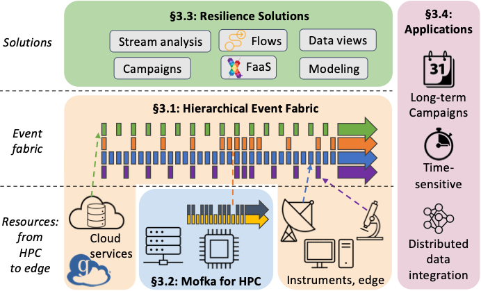

## Resilience-enabling services for science from HPC to edge

An [**AI-guided simulation campaign**](Text/applications.md) that engages computers at multiple sites to evaluate many small molecules for use against a new pathogen. A [**real-time data analysis pipeline**](Text/applications.md) that processes data from a scientific instrument so as to enable experimental steering. A [**multi-messenger astronomy application**](Text/applications.md) that integrates data from observational and simulation sites to detect and respond rapidly to rare astronomical events. Each of these mission-critical applications depends on distributed computation for its success and is thus easily subject to disruptions due to  failures, disruptions, and other anomalies. 

Our goal in the Diaspora project is to develop new methods for building next-generation resilient scientific applications capable of executing in an increasingly integrated research infrastructure. Experience in other domains, such as public clouds, has demonstrated the power of event-driven communication as a foundation for resilient solutions. However, such approaches are under-exploited in scientific computing due to different scales, scope, and service level requirements. We hypothesize that:

> Addressing the resilience needs of a broad set of DOE applications requires methods for gaining knowledge of resources and applications and for translating that knowledge into action. 
These two needs can be met by establishing a **unifying event fabric** that extends across sites, facilities, and computations to provide timely, reliable, and accurate information about data, application, and resource status, and by developing **resilience services** that leverage information provided by this fabric to meet broad classes of resilience needs.

Thus, as outlined in the figure, we are working to create a **hierarchical event fabric** (encompassing, via **Mofka**, HPC); to develop **resilience services** that build on event fabric capabilities to provide, e.g., resilient compute pools and streaming; and to evaluate these new capabilities in **scientific applications** such as those listed above. 

    

Some recent project publications:

* [Employing artificial intelligence to steer exascale workflows with Colmena](https://journals.sagepub.com/doi/pdf/10.1177/10943420241288242), L. Ward et al., 2024: Describes the Colmena framework that we use in developing AI-guided simulation campaign applications.
* [Octopus: Experiences with a hybrid event-driven architecture for distributed scientific computing](https://arxiv.org/pdf/2407.11432), H. Pan et al., 2024: Introduces the Octopus framework that we are developing for scalable distributed event delivery.
* [Diaspora: Resilience-Enabling Services for Real-Time Distributed Workflows](https://ieeexplore.ieee.org/abstract/document/10678669), B. Nicolae et al., 2024: Project overview paper.
* [Efficient distributed continual learning for steering experiments in real-time](https://www.sciencedirect.com/science/article/pii/S0167739X24003820), T. Bouvier et al., 2025. Rehearsal-based continual learning for scientific applications.
* [MOFA: Discovering Materials for Carbon Capture with a GenAI- and Simulation-Based Workflow](https://arxiv.org/abs/2501.10651), X. Yan et al., 2025: A real-time workflow combining generative AI and HPC simulations to discover novel metal-organic frameworks (MOFs) for carbon capture.
* [D-Rex: Heterogeneity-Aware Reliability Framework and Adaptive Algorithms for Distributed Storage](tbd), M. Gonthier et al., 2025: A resilient solution for chunking and placing erasure-coded data on heterogeneous storage nodes.
* [WRATH: Workload Resilience Across Task Hierarchies in Task-based Parallel Programming Frameworks](https://arxiv.org/abs/2503.12752), S. Zhou et al., 2025: A resilience module that categorizes and handles failures in task-based parallel programming frameworks.
* [Resilient Execution of Distributed X-ray Image
Analysis Workflows](https://www.frontiersin.org/journals/high-performance-computing/articles/10.3389/fhpcp.2025.1550855/abstract), H Nguyen et al., 2025: Resilient solutions for distributed X-ray image analysis workflows.

Project participants include:
* At [JHU](https://www.jhu.edu), [Alessandra Corsi](https://www.depts.ttu.edu/phas/People/Faculty/bio_corsi/bio_corsi.php)
* At [SLAC](https://slac.stanford.edu), Ryan Coffee and Jana Thayer
* At [ORNL](https://www.ornl.gov), Nagi Rao and Anees Najjar
* At [Argonne](https://www.anl.gov): Ian Foster, Tekin Bicer, Phil Carns, Kyle Chard, Ryan Chard, Matthieu Dorier, Eliu Huerta, Raj Kettimuthu, Bogdan Nicolae, Rob Ross, Justin Wozniak.

We are looking for people who want to help us build out these solutions: postdocs, students, visiting scientists, collaborators, and others. If you think that you might be interested, please get in touch with [Ian Foster](mailto:foster@anl.gov). We look forward to hearing from you! 

And just for fun, a [description of the project suitable for a kindergartener](Text/kindergartener.md).

---

Diaspora involves researchers at Argonne National Laboratory, Oak Ridge National Laboratory, SLAC, and Texas Tech University, and is supported by a grant from the US Department of Energy's [Office of Advanced Scientific Computing Research](https://science.osti.gov/ascr), under program manager [Margaret Lentz](https://science.osti.gov/ascr/About/Staff). Access at [diaspora-project.github.io](https://diaspora-project.github.io). For more information contact [Ian Foster](mailto:foster@anl.gov). 

